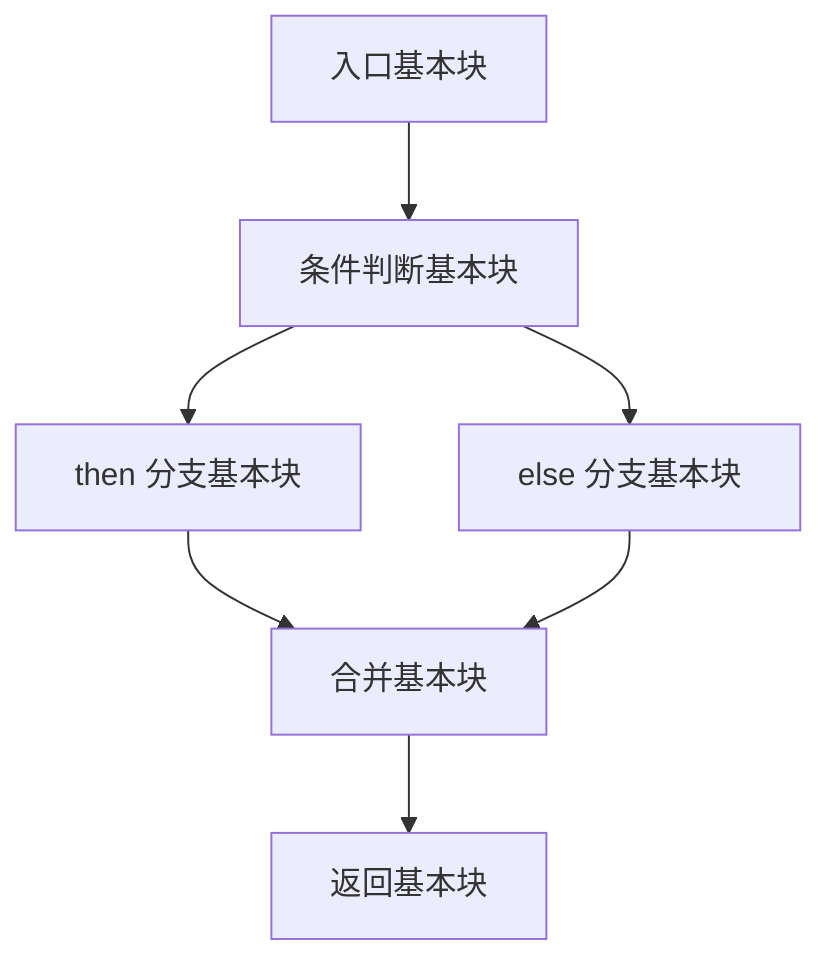
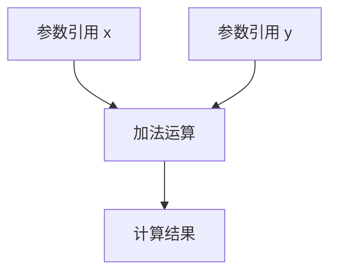
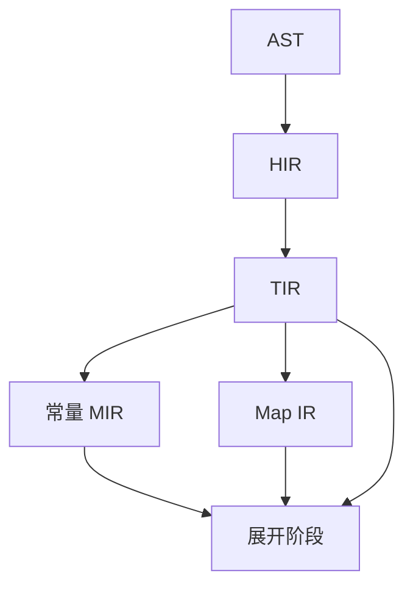

# 常量 MIR 与 Map IR

欢迎来到常量 MIR 与 Map IR 篇章！上一篇文章介绍了 HIR 和 TIR。在语义分析阶段，除了 TIR，编译器还产生两种额外的中间表示：常量 MIR 和 Map IR。这篇文章我们先回答它们分别是什么、用于什么场景，然后分别展示它们的内部结构，最后说明它们和 TIR 的关系。

---

## 它们解决什么问题

Syl 中有两种特殊的声明：`fn`（函数）和 `map`（组合映射）。它们都在编译期被求值，但求值方式不同。

**`fn` 是一个可调用的函数。** 它包含控制流：条件分支、循环、返回语句。`fn` 在编译期执行，结果用于计算泛型参数和常量表达式。

**`map` 是一个纯组合映射。** 它没有控制流，没有状态，没有副作用。`map` 在展开阶段被内联展开为组合逻辑。

这两种声明需要不同的中间表示来描述它们的计算过程。

## 常量 MIR

常量 MIR（Constant Middle-level Intermediate Representation）是 `fn` 函数在编译期的执行表示。

### 什么是控制流图

常量 MIR 使用控制流图（Control Flow Graph）来表示函数。控制流图由基本块（Basic Block）组成。每个基本块包含一组顺序执行的语句，以一个终结指令结束。



基本块之间通过终结指令连接：

- **Goto**：无条件跳转到另一个基本块
- **Branch**：根据条件跳转到 then 块或 else 块
- **Return**：结束函数执行，返回一个值

### 一个例子

对于这段 Syl 代码：

```syl
fn max(a: Nat, b: Nat) -> Nat {
    if a > b {
        return a
    } else {
        return b
    }
}
```

常量 MIR 会生成三个基本块：

**入口基本块：**
```
local.0 = a
local.1 = b
→ Branch(cond: local.0 > local.1, then: B1, else: B2)
```

**then 分支（B1）：**
```
→ Return(local.0)
```

**else 分支（B2）：**
```
→ Return(local.1)
```

### 基本块内部

每个基本块包含两部分：

**语句列表。** 目前常量 MIR 只支持一种语句：`Assign`（赋值）。每条赋值语句将一个局部变量绑定到一个常量表达式。

**终结指令。** 决定接下来执行哪个基本块。有三种终结指令：

- `Goto(block)`：无条件跳转到指定基本块
- `Branch { cond, then_block, else_block }`：条件跳转，根据 `cond` 的值选择分支
- `Return(value)`：返回一个值

### 求值过程

常量 MIR 的求值由 `ConstEvaluator` 执行。它从入口基本块开始，按终结指令的指示依次执行基本块。如果遇到 `Branch`，根据条件值选择分支。如果遇到 `Return`，将值返回给调用方。

求值结果是一组常数值。这些值在展开阶段用于计算泛型参数和数组大小。

## Map IR

Map IR（Map Intermediate Representation）是 `map` 函数的中间表示。

### 什么是表达式树

Map IR 使用表达式树（Expression Tree）来表示 `map` 函数。表达式树是一棵树，叶子节点是字面量或参数引用，内部节点是运算符或函数调用。



### 一个例子

对于这段 Syl 代码：

```syl
map double(x: UInt<8>) -> UInt<8> = x + x
```

Map IR 生成的表达式树：

```
MapExpr::Binary {
    op: Add,
    left: MapExpr::Ident(x),
    right: MapExpr::Ident(x)
}
```

### 支持的表达式类型

Map IR 的表达式树包含这些节点类型：

| 表达式类型 | 说明 | 示例 |
|-----------|------|------|
| `Ident` | 参数引用 | `x` |
| `Int` | 整数字面量 | `42` |
| `Bool` | 布尔字面量 | `true` |
| `Str` | 字符串字面量 | `"hello"` |
| `Unary` | 一元运算 | `-x`、`not x` |
| `Binary` | 二元运算 | `a + b`、`a and b` |
| `Call` | 函数调用 | `add(x, y)` |
| `Aggregate` | 聚合构造 | `Pair { left: x, right: y }` |
| `Field` | 字段访问 | `packet.payload` |
| `Index` | 索引访问 | `arr[0]` |
| `Match` | 模式匹配 | `match color { ... }` |
| `Select` | 条件选择 | `select { a => x, b => y }` |

### 求值过程

Map IR 的求值由展开阶段执行。展开器接收一个 `map` 调用的参数值，沿着表达式树从叶子到根计算每个节点的值，最终得到输出。

## 常量 MIR 和 Map IR 的区别

| 特性 | 常量 MIR | Map IR |
|------|---------|--------|
| 适用声明 | `fn` | `map` |
| 数据结构 | 控制流图（基本块） | 表达式树 |
| 控制流 | 有（分支、循环、返回） | 无 |
| 状态 | 有（局部变量） | 无 |
| 副作用 | 不允许 | 不允许 |
| 求值时机 | 编译期求值 | 展开期内联展开 |
| 求值方式 | 解释执行 | 表达式计算 |

两者的共同点：都不允许副作用，都在编译期或展开期完成，都定义在 `syl_sema` crate 中，都被 `syl_elab` crate 消费。

## 和数据流的关系



常量 MIR 和 Map IR 都从 TIR 下降产生（TIR 已经完成了名字解析和类型检查）。它们和 TIR 一起被传递给展开阶段。

在展开阶段内部，常量 MIR 和 Map IR 最先被求值。求值结果用于后续的 EIR 构建（比如确定模块的泛型参数值和数组大小）。

