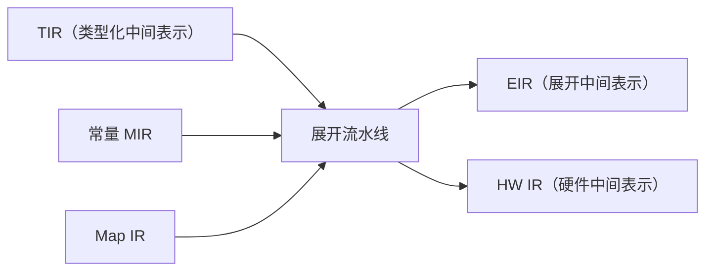
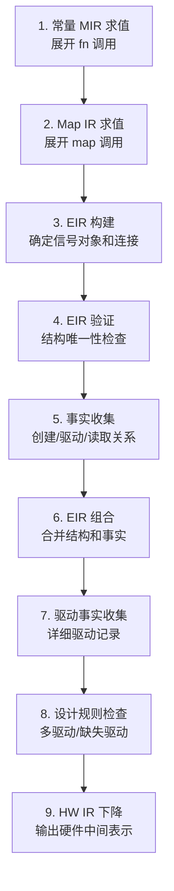

# 展开与 EIR

欢迎来到展开与 EIR 篇章！这篇文章深入编译器最复杂的阶段——展开。我们先回顾展开的输入和输出，然后展示它内部那条包含 9 个步骤的流水线，重点解释 EIR（展开中间表示）的数据结构和设计规则检查。最后说明 HW IR 下降。

---

## 展开的输入和输出

展开阶段的输入来自语义分析：TIR、常量 MIR 和 Map IR。输出是两个中间表示：EIR 和 HW IR。



输入包含三类信息：

- **TIR**：每个表达式的类型、每个绑定的名字、名字解析结果
- **常量 MIR**：`fn` 函数的编译期求值表示
- **Map IR**：`map` 函数的表达式树表示

展开阶段将它们组合为具体的硬件结构。

## 展开流水线

展开内部包含 9 个子步骤，按顺序执行：



### 第 1 步：常量 MIR 求值

展开器调用常量求值器，执行所有 `fn` 函数调用。这一步计算出泛型参数的具体值、数组大小、条件表达式的值。

举个例子，如果模块中有一处 `Counter<W = WIDTH>`，而 `WIDTH` 是一个 `const` 常量，展开器需要先求出 `WIDTH` 的值，才能确定 `Counter` 模块的具体端口宽度。

### 第 2 步：Map IR 求值

展开器评估所有 `map` 调用。`map` 函数是纯组合逻辑，展开器将 `map` 调用替换为对应的组合逻辑表达式。

### 第 3 步：EIR 构建

EIR 构建是展开的核心步骤。它将 TIR 中的每个模块展开为 EIR 中的模块结构。这一步负责：

- 将每个 `signal` 和 `reg` 声明转换为 EIR 对象
- 将每个 `:=` 和 `next` 赋值转换为 EIR 驱动关系
- 将每个 `place` 实例化转换为硬件实例

EIR 构建的输出是原始 EIR（EirRawDesign）。它是未经验证的展开结果。

### 第 4 步：EIR 验证

EIR 验证检查展开结果的结构合法性：

- 模块名称是否唯一
- 每个模块内部的信号名称是否唯一
- 信号的位宽声明是否合法

### 第 5 步：事实收集

事实收集分析 EIR 中每个对象的三种关系：

- **创建关系**：哪些 `signal` 和 `reg` 声明产生了哪些对象
- **驱动关系**：哪些赋值操作连接了驱动源和目标
- **读取关系**：哪些表达式读取了对象的值

### 第 6 步：EIR 组合

将原始 EIR 和收集到的事实合并为完整的 EIR 设计（EirDesign）。合并后的 EIR 同时包含模块结构和事实信息。

### 第 7 步：驱动事实收集

驱动事实收集器为每个驱动操作建立详细记录。它比第 5 步的事实收集更精细：

- 记录哪个模块驱动了哪个信号
- 记录驱动是连续赋值（`:=`）还是时序赋值（`next`）
- 记录驱动在哪个条件下生效（guard）
- 记录驱动来自哪个源码位置

### 第 8 步：设计规则检查

设计规则检查（DRC）使用驱动事实检测硬件设计中的问题。主要检查三类：

**多驱动冲突。** 同一个信号被两个不同的来源驱动。例如：

```syl
cell DoubleDrive() -> y: Bit {
    y := 0
    y := 1
}
```

编译器检测到 `y` 被赋值了两次，报告错误。诊断信息包含两个驱动的位置。

**缺失驱动。** 一个 `out` 端口没有被任何赋值覆盖。例如：

```syl
cell NoDriver(y: out Bit) {
    // y 没有被赋值
}
```

编译器检测到 `y` 作为输出端口从未被驱动，报告错误。

**重叠驱动。** 在条件选择中，多个分支驱动了同一个目标。例如：

```syl
signal s: Bit := select unique {
    a => 1,
    b => 1,
}
```

如果 `a` 和 `b` 可能同时为真，在 `unique` 模式下这构成重叠驱动。

### 第 9 步：HW IR 下降

最后一步将 EIR 转换为 HW IR（硬件中间表示）。HW IR 是后端无关的表示，不包含展开过程中的临时状态。

## EIR 的数据结构

EIR 的核心结构包含三个层级：

**EIR 模块（EirModule）。** 每个被展开的 TIR 模块对应一个 EIR 模块。模块包含名字、端口列表、内部对象列表、驱动关系列表。

**EIR 对象（EirObject）。** 每个信号或寄存器对应一个 EIR 对象。对象记录：

- 所属模块
- 对象名字
- 位宽
- 类型（Signal 或 Storage）
- 来源（Origin）

**EIR 驱动（EirDrive）。** 每个赋值操作对应一个 EIR 驱动。驱动记录：

- 所属模块
- 目标信号
- 驱动值表达式
- 驱动类型（连续赋值或时序赋值）
- 条件守卫（Guard）
- 来源

EIR 的数据结构在设计上和后端阶段是隔离的。后端阶段不需要了解 EIR 的细节，它只读取 HW IR。

