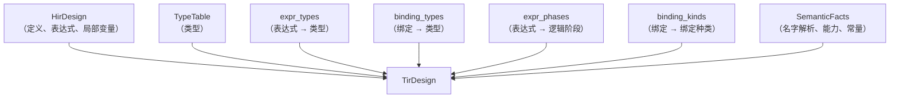
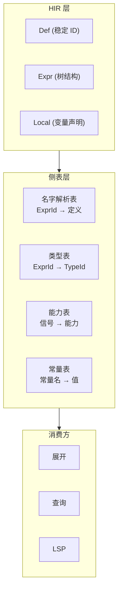

# HIR 与 TIR

欢迎来到 HIR 与 TIR 篇章！这篇文章我们先回答两个问题：HIR 和 TIR 分别是什么，它们之间是什么关系。然后解释为什么分成 HIR 和 TIR 两层，以及这一步到位相比有什么好处。之后分别展示 HIR 的构成和 TIR 的构成，用 Syl 代码示例说明从 AST 到 HIR 再到 TIR 的完整过程。最后讲 side table 模式的设计思想。

---

## 什么是 HIR

HIR 的全称是 High-level Intermediate Representation，即高层中间表示。

HIR 是 AST 经过语义分析第一阶段后产生的结构化表示。它有两项核心工作：

**第一，消除语法糖。** Syl 源代码中有多种写法表达同一个意思。例如赋值语句 `x := y`、`next x := y`、模块返回值绑定等，在 HIR 中被统一为内部赋值表达式。编译器后续阶段不需要关心用户用的是哪种写法。

**第二，分配稳定 ID。** HIR 为每个定义、每个表达式、每个局部变量分配一个数字 ID。这些 ID 在编译器的后续阶段中用于引用同一个对象。即使文件名变了、代码行号变了，只要源代码没有实质改动，HIR ID 就不变。

HIR 本身不携带类型信息。它只是一个结构化的骨架。

## 什么是 TIR

TIR 的全称是 Typed Intermediate Representation，即类型化中间表示。

TIR 是 HIR 加上一组侧表（side table）构成的。编译器在 HIR 的基础上附加侧表，记录每个表达式是什么类型、每个绑定是什么类型、每个表达式属于组合逻辑还是时序逻辑。TIR 本身没有独立的树结构。

用一句话总结它们的关系：

> TIR = HIR + 侧表

HIR 回答"结构是什么"，TIR 回答"类型是什么"。

## 为什么需要两层

为什么不一步到位生成 TIR？原因是关注点分离。

HIR 的生成只需要查看 AST 的结构。它不关心名字有没有解析到、类型是否匹配。这意味着 HIR 可以先生成，然后名字解析和类型检查在 HIR 的基础上分步进行。

如果一步到位生成 TIR，语义分析的所有工作必须串行完成。但分成两层后：

- HIR 可以先生成，用于编辑器的基本功能（跳转定义、文件结构）
- 名字解析在 HIR 上执行，产生解析结果
- 类型检查在 HIR 上执行，产生类型侧表
- 能力检查在 HIR 上执行，产生能力侧表

每一层只做一件事，可以独立测试和调试。

## HIR 的构成

HIR 的数据定义在 `syl_hir` crate 中。HIR 整体是一个 HirDesign，它包含六个主要部分：

**定义（Def）。** 每个顶层声明是一个定义，比如 `cell Top`、`fn add`、`const WIDTH`。每个定义有一个唯一的 `DefId`。

**表达式（Expr）。** 函数体或模块体中的每个表达式都有一个唯一的 `ExprId`。表达式可以是字面量、标识符、二元运算、函数调用、聚合构造等。

**局部变量（Local）。** 每个 `let`、`signal`、`reg` 绑定有一个唯一的 `LocalId`。

**包（Package）。** 每个源文件属于一个包。包有一个唯一的 `PackageId`。

**导入（Import）。** 每个 `use` 指令对应一个导入记录。

**名字解析结果。** 每个表达式和绑定对应一个解析结果，记录它引用的是哪个定义。

下面是一个具体的例子。对于这段 Syl 代码：

```syl
const WIDTH: Nat = 8

fn double(x: Nat) -> Nat {
    return x + x
}

const W: Nat = double(WIDTH)
```

HIR 会包含这些定义：

| DefId | 类型 | 名字 |
|-------|------|------|
| D0 | ConstItem | WIDTH |
| D1 | FnItem | double |
| D2 | ConstItem | W |

`double` 的函数体包含一个表达式 `x + x`。这个表达式的结构在 HIR 中表示为：

```
Expr(Binary {
    op: Add,
    left: Expr(Ident("x")),
    right: Expr(Ident("x"))
})
```

两个 `Ident("x")` 各有自己的 `ExprId`。名字解析结果记录它们都引用 `double` 函数的参数 `x`。

## TIR 的构成

TIR 的定义在 `syl_sema` crate 中。TIR 把 HIR 包在内部，加上侧表：



具体来说，侧表回答这些问题：

**TypeTable：** 当前设计中所有已知的类型。比如 `Bit`、`UInt<8>`、`UInt<WIDTH>` 等。每个类型分配一个 `TypeId`。

**expr_types：** 每个表达式对应的类型。给定一个 `ExprId`，查到它的 `TypeId`，再去 TypeTable 中查具体类型。

**binding_types：** 每个绑定（`let`、`signal`、`reg`、`in` 端口、`out` 端口）对应的类型。

**expr_phases：** 每个表达式属于组合逻辑阶段还是时序逻辑阶段。组合逻辑的值取决于当前输入，时序逻辑的值取决于时钟边沿。

**binding_kinds：** 每个绑定的种类：是普通绑定、信号声明、还是寄存器声明。

**SemanticFacts：** 名字解析、能力信息、常量求值结果等。

## Side table 模式

Side table 模式是 Syl 编译器的一个核心设计模式。

传统做法是为"带类型的 HIR"定义一套全新的数据结构，比如 `TypedExpr`、`TypedStmt`。但这意味着 HIR 和 TIR 的数据结构是独立的，需要写代码在两者之间做转换。

Side table 模式的做法是：HIR 的数据结构不动，在旁边加一个映射表。映射表的键是 HIR 中的 ID（`ExprId`、`LocalId`），值是类型或其他语义信息。

这种模式的好处：

- **不复制数据。** HIR 的表达式树不需要为 TIR 重建一份。
- **按需计算。** 不需要一次性算出所有侧表。名字解析只需要 ResolutionTable，类型检查只需要 TypeTable。
- **独立演进。** HIR 的数据结构变化不影响 TIR 的侧表。反过来，增加一种新的侧表（比如增加时钟域信息）不需要修改 HIR。
- **测试友好。** 侧表可以独立于 HIR 进行测试。



在代码中，TIR 的内部结构大致是这样的概念模型：

```
TirDesign {
    // HIR 的完整内容（不修改）
    hir: HirDesign,
    // 加在上面的侧表（附加信息）
    type_table: 所有已知类型的列表,
    expr_types:  表达式 → 类型的映射,
    binding_types: 绑定 → 类型的映射,
    expr_phases: 表达式 → 逻辑阶段的映射,
    facts: 名字解析 + 能力 + 常量信息,
}
```

## 从 HIR 到 TIR 的流程

HIR 和 TIR 的生成顺序是：

1. **HIR 下降。** 从 AST 生成 HIR。这一步只分析结构，不查名字、不算类型。
2. **名字解析。** 遍历 HIR，将每个名字和它引用的定义对应起来。
3. **类型检查。** 遍历 HIR 的表达式树，计算每个表达式的类型。类型检查结果写入 TypeTable 和 expr_types。
4. **能力检查。** 遍历 HIR 的端口和赋值，检查信号方向是否合规。
5. **常量求值。** 计算 HIR 中的 `const` 和 `fn` 表达式。

每一步都在 HIR 的基础上添加新的侧表。没有哪一步需要修改 HIR 本身。

