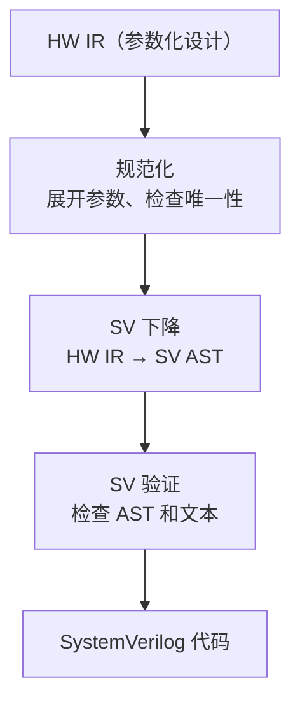
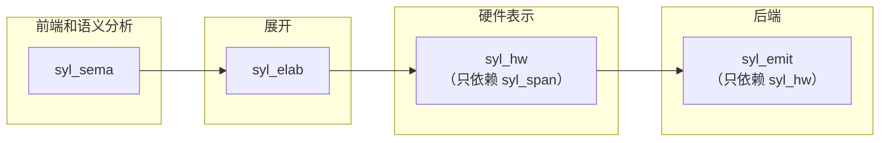

# 硬件 IR 与 SV 后端

欢迎来到硬件 IR 与 SV 后端篇章！这篇文章我们分两部分讲解。先介绍 HW IR（硬件中间表示）——它是展开和后端之间的接口，后端无关。然后介绍后端如何处理 HW IR，将其转换为 SystemVerilog 代码。

---

## HW IR

### HW IR 是什么

HW IR（Hardware Intermediate Representation）是展开阶段的最终输出、后端的输入。它是一种后端无关的硬件表示。

"后端无关"的含义是：HW IR 不包含任何 SystemVerilog 特有的语法或约定。它只描述硬件的结构——有哪些模块、端口、实例和连接。不同的后端（SystemVerilog、Verilog、VHDL）都可以将 HW IR 作为输入。

HW IR 的数据结构定义在 `syl_hw` crate 中。它只依赖 `syl_span`（源码位置），不依赖前端、语义分析或展开 crate。

### 核心数据结构

HW IR 包含四个层级：

**HwDesign（硬件设计）。** 顶层容器，包含一个模块列表。

**HwModule（硬件模块）。** 对应一个硬件模块，包含：

- 模块名字
- 泛型参数列表
- 端口列表
- 内部项列表（实例、赋值、信号声明）

**HwPort（硬件端口）。** 模块的端口，记录：

- 端口名字
- 方向（In、Out、InOut）
- 宽度
- 源码位置

**HwItem（硬件项）。** 模块内部的构造，包括：

- `HwItem::Instance`：另一个模块的实例
- `HwItem::ContinuousDrive`：连续赋值（对应 `assign`）
- `HwItem::Net`：信号声明

**HwExpr（硬件表达式）。** 用于表示赋值右侧的值，支持：

- 标识符引用
- 字面量
- 二元运算（加法、按位与等）
- 选择表达式（select）
- 高阻态（HighZ）

### 参数化设计

HW IR 支持参数化设计。`ParametricHwDesign` 是对 `HwDesign` 的封装，允许模块携带泛型参数。在展开阶段，有的参数可能还没有绑定具体值。后端的规范化步骤会展开参数化模块，生成没有泛型参数的具体设计。

## 后端

后端的输入是 HW IR，输出是 SystemVerilog 代码。后端由 `syl_emit` crate 实现。



### 规范化

规范化是第一步。它由 `HwNormalizer` 执行，对 HW IR 做三项检查：

- **名字唯一性。** 模块名称不重复，模块内部的对象名称不重复。
- **引用有效性。** 所有引用的模块、信号、端口都存在。
- **参数展开。** 将参数化模块展开为具体实例。

如果检查失败，规范化器返回结构化的错误报告。报告包含具体的诊断条目，比如哪个名字重复了、哪个引用不存在。

### SV 下降

SV 下降是将 HW IR 转换为 SV 特有的中间表示（SV AST）的过程。这一步由 `SvEmitter` 执行。

映射规则很简单：

```
HW IR 构造          → SystemVerilog 构造
──────────────────────────────────────
HwModule           → module … endmodule
HwPort(Direction)  → input / output / inout
HwItem::Instance   → 模块实例化
HwItem::ContinuousDrive → assign
HwExpr::HighZ      → 'z
```

SV 下降器遍历规范化后的 HW IR，为每个模块生成一个 SV 模块结构。SV 模块包含端口声明、参数声明和内部项。

### SV 验证

SV 验证分两步执行：

**后端验证。** 检查 SV AST 的结构是否合法。例如：

- 每个端口都有名字和方向
- 每个 `assign` 语句左侧和右侧类型匹配
- 模块有结束标记

**源码验证。** 检查最终的字符串输出：

- 括号是否匹配
- `begin` 和 `end` 是否配对
- `module` 和 `endmodule` 是否配对

### Verilator 烟雾测试

在 CI 中，生成的 SystemVerilog 代码会通过 Verilator 进行烟雾测试。Verilator 是一个开源工具，可以检查 SystemVerilog 的语法和基本语义。

烟雾测试验证两件事：

- 生成的代码可以被 Verilator 解析，没有语法错误
- 生成的代码可以被 Verilator 优化，没有逻辑错误

如果 Verilator 测试失败，说明编译器输出了不合法的 SystemVerilog 代码。

## HW IR 和后端的隔离

HW IR 和后端之间有一个重要的设计约束：**HW IR 不依赖后端，后端不依赖前端。**



这种隔离带来两个好处：

- **更换后端不需要修改 HW IR。** 如果将来要支持 VHDL 输出，只需要新增一个后端 crate，不需要改动 HW IR 的数据结构。
- **后端错误不会影响前端。** 如果生成 SV 代码时出错，不会牵连语义分析的结果。
- **独立测试。** 后端的测试不需要编译完整的 Syl 前端，只需要构造 HW IR 数据即可测试后端的逻辑。

