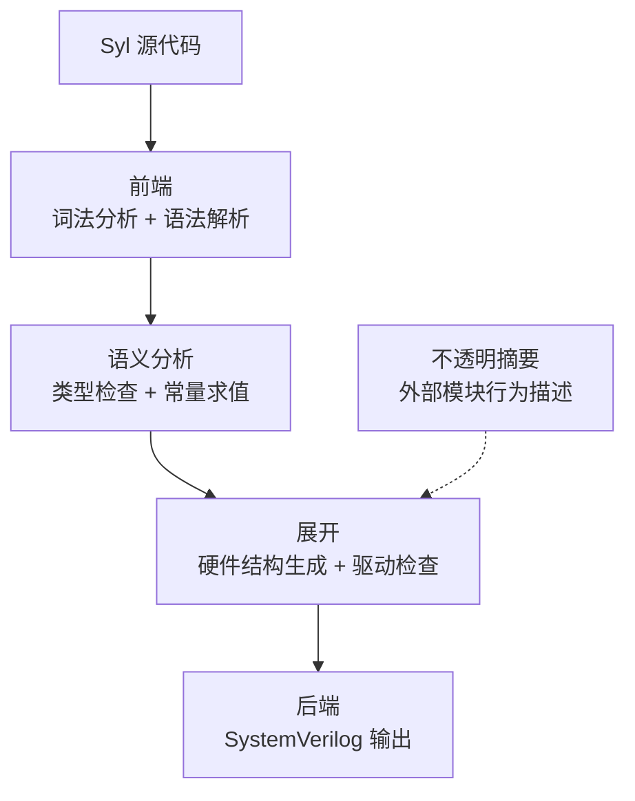

# Syl 编译器内部：架构总览

欢迎来到 "Syl 编译器内部" 章节！这篇文章我们从整体上俯瞰 Syl 编译器。先回答 Syl 是什么，然后展示整个编译过程的阶段划分，重点解释每个阶段解决什么问题、输出什么。之后讲三条核心设计原则。最后给出 crate 和阶段的对应关系。

---

## Syl 是什么

Syl 是一门硬件描述语言，也是一个编译器。

你用 Syl 编写数字电路描述。编译器将这份描述转换为 SystemVerilog 代码，交给下游工具综合和验证。

Syl 和 Verilog、VHDL 在工程目标上最大的区别在于：Syl 编译器在编译期对设计做完整检查。一个通过编译的 Syl 程序保证没有未连接的端口、没有类型不匹配的连接、没有多驱动冲突。这些保证来自编译器内部的分阶段设计，每个阶段在自己的职责范围内做检查和转换。

## 编译流程

Syl 编译器从源代码到 SystemVerilog 经历以下阶段：

实线箭头表示数据传递。虚线箭头（不透明摘要）表示注入信息。

## 每个阶段

### 阶段 1：中间表示体系

阶段 1 不是一段会运行的代码。它是一套约定，规定了每个中间表示由哪个 crate 拥有、边界在哪里。

这套约定解决一个实际问题：大型编译器项目中，不同的人负责不同模块。如果没有明确的中间表示归属，很容易出现数据定义重复，或者 A 模块直接修改 B 模块的数据。

具体的中间表示归属：

- **TIR、常量 MIR、Map IR** 由 `syl_sema` 拥有
- **EIR** 由 `syl_elab` 拥有
- **HW IR** 由 `syl_hw` 拥有
- **SV AST** 由 `syl_emit` 拥有

每个中间表示只有一个定义来源。没有重复的数据定义。

阶段 1 也定义了端到端的编译流程：语义分析 → 展开 → 后端。这个流程在架构测试中被反复验证。

### 阶段 2：前端

前端的输入是源代码文本。输出是抽象语法树（AST）。

前端做两件事：词法分析（文本分割成 Token）和语法解析（Token 组合成 AST）。如果代码有语法错误，前端不会崩溃，而是尝试恢复并继续解析。

前端由 `syl_syntax` crate 实现。它只依赖 `syl_span`（源码位置和诊断结构），不依赖语义分析或后端 crate。

### 阶段 3：语义分析

语义分析的输入是 AST。输出是 TIR（类型化中间表示），以及常量 MIR 和 Map IR。

语义分析依次执行：

1. **HIR 下降。** 消除语法糖，生成稳定 ID。
2. **名字解析。** 将每个名字和它的声明对应起来。
3. **类型检查。** 计算每个表达式的类型，检查赋值两侧是否一致。
4. **能力检查。** 检查信号的驱动方向和读写权限是否和端口声明一致。
5. **常量求值。** 在编译期执行函数和常量表达式。

语义分析由 `syl_sema` crate 实现。它依赖 `syl_hir`（HIR 数据定义）和 `syl_syntax`。

### 阶段 4：展开

展开的输入是 TIR 和常量求值结果。输出是 EIR 和 HW IR。

展开是将类型化的描述转换为具体硬件结构的过程。它内部有一条流水线，依次执行：

1. **常量 MIR 求值。** 展开 `fn` 调用。
2. **Map IR 求值。** 展开 `map` 调用。
3. **EIR 构建。** 将每个模块展开，确定它的内部信号对象。
4. **EIR 验证。** 检查模块名称和信号名称是否唯一。
5. **事实收集。** 分析每个对象的创建、驱动和读取关系。
6. **驱动事实收集。** 为每个驱动操作建立详细记录。
7. **设计规则检查。** 检测多驱动冲突、缺失驱动等问题。
8. **硬件元数据。** 汇总展开后的结构信息。
9. **HW IR 下降。** 将 EIR 转换为后端无关的硬件中间表示。

展开由 `syl_elab` crate 实现。它是编译器中最复杂的阶段。

### 阶段 5：不透明摘要

不透明摘要是一种描述机制。当编译器看不到一个模块的实现代码时（比如外部 IP 核），它需要一份摘要来了解这个模块的行为。

摘要包含的信息：端口端点（名称、方向、类型、能力）、驱动字段（这个模块会驱动哪些信号）、延迟类别、信任边界（摘要的来源）。

摘要的数据类型定义在 `syl_sema` 中，注册和管理由 `syl_session` 协调。摘要一旦注册就参与展开过程，DRC 会将摘要声明的驱动视为有效的驱动源。

### 阶段 6：后端

后端的输入是 HW IR。输出是 SystemVerilog 代码。

后端依次执行：

1. **HW IR 规范化。** 检查名字唯一性，展开参数化模块。
2. **SV 下降。** 将 HW IR 转换为 SV 特有的中间表示。
3. **SV 验证。** 检查 SV 代码的语法正确性。

后端由 `syl_emit` crate 实现。`syl_hw` crate 提供后端无关的硬件中间表示。

## 配套工具

除了编译流水线，Syl 还提供两个配套工具：

**查询引擎（syl_query）。** 对编译结果提供只读访问。编辑器通过它获取悬停提示、跳转定义、自动补全信息。查询引擎只能访问语义分析的结果，不能触发展开和后端编译，以确保编辑器的响应速度。

**LSP 语言服务器（syl_lsp）。** 将查询引擎的输出适配到 LSP 协议。它是一个独立的进程，通过标准输入输出和编辑器通信。

**标准库。** 一组用 Syl 编写的硬件抽象，包含 Stream（流接口）、Stage（流水线阶段）等常用组件。标准库是 Syl 代码，和其他 Syl 代码一样经过完整编译。

## 三条核心设计原则

### 阶段独立

每个阶段只依赖前一阶段的输出。语义分析不依赖展开的结果。后端不依赖语义分析的内部数据结构。这种设计让每个阶段可以独立修改和测试。

### 单拥有者

每个中间表示只有一个拥有 crate。如果需要修改某个中间表示的数据结构，只需要改一个 crate。如果需要了解某个中间表示的完整定义，只需要看一个 crate。

### 增量缓存

`AnalysisHost` 管理缓存的编译结果。当某个文件变化时，只有包含该文件的包的缓存被标记为过期。其他包的缓存仍然有效。这意味着修改一个文件不会触发对全部代码的重新编译。

## Crate 与阶段的对应

| Crate | 所属阶段 | 职责 |
|-------|---------|------|
| `syl_span` | 通用基础设施 | 源码位置、诊断结构 |
| `syl_syntax` | 阶段 2 | 词法分析、语法解析、AST |
| `syl_hir` | 阶段 3 | HIR 数据结构和稳定 ID |
| `syl_sema` | 阶段 3、5 | 语义分析、类型检查、不透明摘要 |
| `syl_elab` | 阶段 4 | 展开、设计规则检查 |
| `syl_hw` | 阶段 6 | 后端无关的硬件 IR |
| `syl_emit` | 阶段 6 | SystemVerilog 生成 |
| `syl_session` | 通用编排 | 工作区管理、阶段编排 |
| `syl_query` | 配套工具 | 只读查询引擎 |
| `syl_lsp` | 配套工具 | LSP 协议适配 |
| `sylc` | CLI | 命令行入口 |

## 下一步阅读

按以下顺序阅读接下来的文章，效果最好：

1. [仓库地图](/zh/docs/internals/repository-map)：了解 crate 之间的依赖关系
2. [编译流水线](/zh/docs/internals/pipeline)：深入每个阶段的执行细节
3. [语法与 AST](/zh/docs/internals/syntax-ast)：前端如何转换源代码
4. [HIR 与 TIR](/zh/docs/internals/hir-and-tir)：语义分析的两层中间表示
