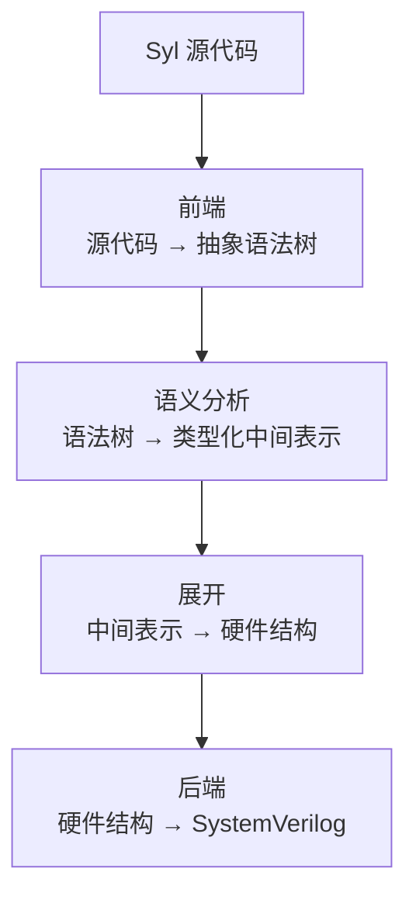
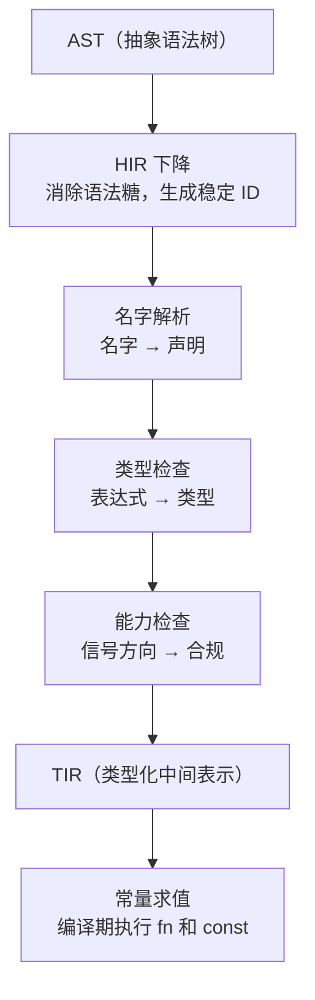
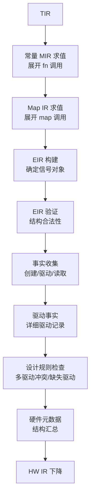
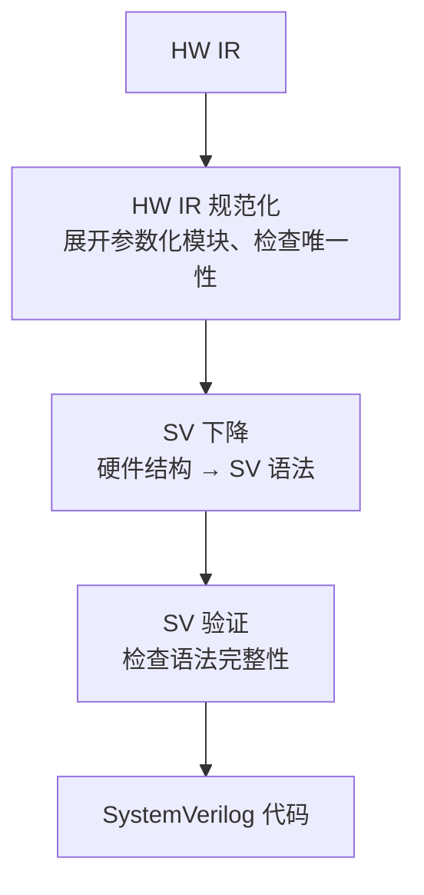

# 编译流水线

欢迎来到编译流水线详解！上一篇文章介绍了 Syl 编译器的阶段划分和 crate 分布。这篇文章我们深入每个阶段的内部，解释每个步骤的输入是什么、做了什么检查、输出了什么。

---

## 从源代码到 SystemVerilog

Syl 编译器从源代码开始，经过前端、语义分析、展开和后端四个阶段，最终输出 SystemVerilog 代码。



每个箭头代表一次数据转换。转换过程中还可能产生诊断信息（错误和警告）。

下面按阶段顺序逐个讲解。

## 前端

### 输入和输出

前端的输入是源代码文本。输出是抽象语法树（AST）。

AST 是源代码的结构化表示。它包含一个顶层声明列表：每个声明可以是模块定义、函数定义、常量定义等。AST 不包含类型信息或名字解析结果。

### 词法分析

词法分析器将源代码文本分割为 Token 序列。每个 Token 记录三样东西：它的类型（是关键字、标识符还是运算符）、它的文本内容、它在源代码中的起止位置。

为什么要先做词法分析？因为编译器需要操作的语法单位是 `:=`（赋值运算符）这样的整体，而不是字符 `:` 加字符 `=`。词法分析把字符流转换为 Token 流，后面的步骤直接操作 Token。

### 语法解析

解析器将 Token 序列按照 Syl 的语法规则组合为 AST。

解析器的核心逻辑是按关键字区分顶层声明类型。看到 `cell` 关键字就知道后面应该跟单元名字、端口列表和函数体。看到 `fn` 就知道后面应该跟函数名字、参数列表和函数体。

对于一段 Syl 代码：

```syl
fn add(a: Nat, b: Nat) -> Nat {
    return a + b
}
```

解析器生成的 AST 结构是：

- 顶层节点：函数定义
  - 名字：`add`
  - 参数列表：两个参数，每个有名字和类型
  - 返回值类型：`Bit`
  - 函数体：一个块，包含一条 return 语句

### 错误恢复

如果代码有语法错误，解析器不会崩溃。它执行错误恢复：跳过无法解析的部分，在 AST 中插入一个错误占位节点，然后从下一个顶层声明继续解析。一个模块内的语法错误不会破坏它后面的模块。

### 无损语法树

除了类型化 AST，前端还生成无损语法树。无损语法树保留源代码中的注释和空白，可以精确还原为原始源代码。类型化 AST 给语义分析用（不需要注释），无损语法树给编辑器用（需要知道光标落在哪个 Token 上）。

## 语义分析

### 输入和输出

语义分析的输入是 AST。输出是 TIR（类型化中间表示），以及常量 MIR 和 Map IR。



### HIR 下降

HIR 下降将 AST 转换为 HIR。这一步做两件事：

**消除语法糖。** Syl 中有多种写法表达赋值：`x := y`、`next x := y`、模块返回值绑定等。HIR 统一为一种内部表示。后面的阶段不需要知道用户用的是哪种写法。

**生成稳定 ID。** 每个定义获得一个 `DefId`，每个表达式获得一个 `ExprId`，每个局部变量获得一个 `LocalId`。这些 ID 在整个编译过程中不变。

### 名字解析

名字解析将每个名字和它的声明对应起来。它回答以下问题：

- 代码中的 `x` 是端口、信号还是变量？
- `UInt` 指的是语言内置类型还是用户自定义的类型？
- `use std.stream.Stream` 导入的是哪个符号？

如果名字无法解析到任何声明，编译器报告错误。

### 类型检查

类型检查计算每个表达式的类型，并检查赋值两侧类型是否一致、函数调用参数类型是否匹配参数声明。

```syl
cell Bad(x: in Bit, y: out UInt<8>) {
    y := x
}
```

类型检查发现 `y` 的类型是 `UInt<8>`，`x` 的类型是 `Bit`，两者不一致。它报告一个结构化的错误，包含错误种类（类型不匹配）、参与的类型（`Bit` 和 `UInt<8>`）以及源码位置。

### 能力检查

Syl 的端口有三种方向：`in`（模块可以读但不能驱动）、`out`（模块可以驱动但不能读）、`inout`（可以读也可以驱动）。能力检查确保模块内部的读写操作和端口的声明方向一致。

### 常量求值

常量求值在编译期执行 `fn` 函数和 `const` 表达式。求值结果在展开阶段用于计算泛型参数和数组大小。

常量求值使用常量 MIR 作为执行表示。常量 MIR 是一种基于基本块的控制流图，适合编译期解释执行。

## 展开

### 输入和输出

展开的输入是 TIR 和常量求值结果。输出是 EIR（展开中间表示）和 HW IR（硬件中间表示）。

展开是编译器中最复杂的阶段。它把类型化的描述展开为具体的硬件结构，然后检查这些结构是否合法。



### 常量 MIR 求值

展开阶段的第一步是求值常量 MIR。常量 MIR 是 `fn` 函数的控制流图表示。展开器调用常量求值器执行 `fn` 函数，计算出常量表达式的结果。

### Map IR 求值

第二步是求值 Map IR。Map IR 是 `map` 函数的表达式树表示。`map` 是纯组合逻辑，没有状态和副作用。展开器将 `map` 调用展开为组合逻辑表达式。

### EIR 构建

第三步是将 TIR 转换为原始的展开中间表示（EIR）。这一步负责将每个模块展开，确定它的内部信号对象；将 `place` 实例化（`cell` 和 `module` 的实例）展开为硬件对象；连接模块之间的信号。

### EIR 验证

第四步检查展开结果的结构是否合法：模块名称不重复、信号名称不重复、信号的位宽声明合法。

### 事实收集

第五步分析 EIR 中每个对象的三种关系：

- **创建关系**：哪些 `signal` 和 `reg` 声明产生了哪些对象
- **驱动关系**：哪些赋值操作连接了驱动源和目标
- **读取关系**：哪些表达式读取了对象的值

### 驱动事实

第六步为每个驱动操作建立更详细的事实记录。它记录哪个模块驱动了哪个信号、驱动是连续赋值还是时序赋值、驱动在哪个时钟域下。

### 设计规则检查

第七步使用收集到的驱动事实检测硬件设计中的常见问题：

- **多驱动冲突。** 同一个信号被两个不同的来源驱动。
- **缺失驱动。** 一个 `out` 端口没有被任何赋值覆盖。
- **重叠驱动。** 在条件选择中，多个分支驱动了同一个目标。

```syl
cell DoubleDrive() -> y: Bit {
    y := 0
    y := 1
}
```

编译器报告的多驱动冲突错误包含冲突的位置和两个驱动来源。

### 硬件元数据

第八步汇总展开后的结构信息：每个模块的端口列表、每个内联单元的摘要、驱动事实的汇总。

### HW IR 下降

第九步将 EIR 转换为后端无关的硬件中间表示（HW IR）。HW IR 不包含展开过程中的临时状态。

## 不透明摘要

### 为什么需要不透明摘要

在某些场景下，编译器无法看到模块的实现代码：

- 用户声明了一个 `extern module`，只有端口签名没有实现体
- 使用了预编译的第三方 IP 核

编译器需要一份摘要来了解这个模块的行为。摘要的核心信息是：这个模块会驱动哪些信号。

### 摘要包含的信息

- **端点**：端口的名称、方向、类型和能力
- **驱动字段**：这个模块内部会驱动哪些输出信号
- **延迟类别**：组合逻辑还是时序逻辑
- **信任边界**：摘要的来源（源代码自动生成、供应商提供、用户自行注册）

### 两种方式

**声明式摘要。** 用户通过 `extern module` 声明外部模块的签名。编译器根据端口方向自动生成默认摘要。对于 `out` 方向端口，默认假设模块会驱动它。

**注入式摘要。** 外部 IP 供应商提供一份摘要文件。这份摘要可以描述更精确的行为（比如"这个模块在内部驱动了某个 `in` 方向端口"），并且携带后端约束。

### 摘要对展开的影响

摘要一旦注册，就参与展开过程。在事实收集阶段，摘要声明的驱动被视为有效的驱动源。在 DRC 阶段，这些驱动参与冲突检测。

## 后端

后端的输入是 HW IR。输出是 SystemVerilog 代码。



### HW IR 规范化

规范化器对 HW IR 进行整理。它检查所有引用的名字是否存在、模块名称和绑定是否唯一。它还展开参数化模块的具体实例，得到没有泛型参数的最终设计。

### SV 下降

SV 下降器将规范化后的 HW IR 转换为 SystemVerilog 特有的中间表示。这一步将硬件结构映射为 SystemVerilog 语法：模块映射为 `module`、端口映射为 `input`/`output`/`inout`、连续赋值映射为 `assign`。

### SV 验证

SV 验证器分两步检查生成的代码：

1. 检查 SV AST 的结构是否完整（每个模块都有结束标记）
2. 检查最终输出的文本中括号是否匹配、模块是否关闭

在 CI 中，生成的 SystemVerilog 代码还会通过 Verilator 进行烟雾测试，确保输出是可综合的。

## 下一步阅读

了解了整个流水线之后，你可以选择深入某个阶段：

- [语法与 AST](/zh/docs/internals/syntax-ast)：深入前端，了解 AST 的内部构造
- [HIR 与 TIR](/zh/docs/internals/hir-and-tir)：深入语义分析，了解两层中间表示的设计
