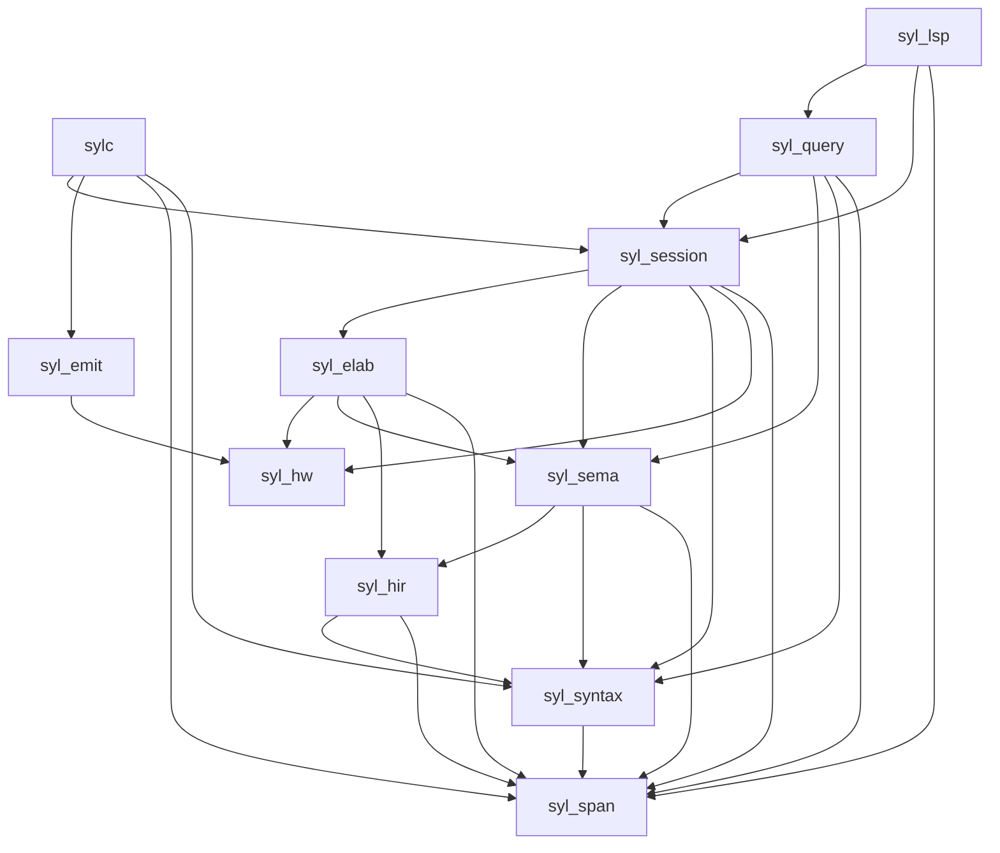

# 仓库地图

欢迎来到仓库地图！这篇文章帮助你回答两个问题：第一，这个仓库里的代码放在哪里；第二，各个 crate 之间如何依赖。弄清楚这两个问题之后，你在阅读编译器源码或调试错误时就知道去哪个 crate 里找答案。

---

## 顶层结构

Syl 编译器仓库是一个 Cargo workspace。顶层目录的结构如下：

```
syl/
├── crates/          # 编译器核心代码（12 个 crate）
├── examples/        # Syl 语言示例
├── conformance/     # 一致性测试套件
├── docs/            # 项目文档
└── fuzz/            # 模糊测试语料
```

编译器的核心逻辑全部在 `crates/` 目录下。每个 crate 负责一个阶段或一个横切关注点。

## 按阶段划分的 crate

### 基础层

这些 crate 被所有其他 crate 依赖，提供最基础的数据类型。

**syl_span。** 源码位置和诊断结构的定义。它提供 `SourceId`（源文件的唯一标识）、`Span`（源码中的一段范围）和 `Diagnostic`（跨 crate 的错误和警告结构）。它是唯一一个不依赖任何其他 Syl crate 的 crate。所有其他 crate 都以它为基底。

为什么需要独立的 span crate？因为编译器中的每个阶段都需要记录源码位置。词法分析记录 Token 的位置，语义分析记录表达式的位置，后端记录硬件对象的位置。如果每个 crate 各自定义位置类型，跨阶段传递时会需要反复转换。`syl_span` 提供一个所有 crate 共享的位置类型。

**syl_syntax。** 词法分析和语法解析。它的输出是抽象语法树（AST）和无损语法树。它只依赖 `syl_span`。

syl_syntax 不做任何语义层面的事情。它检查语法是否正确，但不检查名字是否存在、类型是否匹配。这种隔离意味着改动了语法解析的代码，不会影响语义分析。

**syl_hir。** HIR 的数据结构和稳定 ID 定义。它定义 `DefId`、`ExprId`、`LocalId`、`PackageId` 等标识符，以及 `HirDesign`、`HirExpr` 等数据模型。它只包含数据定义，不包含分析算法。

syl_hir 是一个纯数据 crate。它不实现任何分析逻辑。这种分离让 HIR 的数据结构可以被多个 crate 共享（syl_sema 写入、syl_elab 读取、syl_query 查询），而分析算法各自独立实现。

### 语义分析层

**syl_sema。** 语义分析。它是编译器中最复杂的 crate 之一，负责名字解析、类型检查、能力检查、常量求值和生成 TIR。它依赖 `syl_hir`、`syl_syntax` 和 `syl_span`。

syl_sema 的输出是 TIR（类型化的 HIR 加上侧表）以及常量 MIR 和 Map IR。它还定义了不透明摘要的数据类型。测试代码可以依赖展开和后端 crate，但正常代码不允许。

### 展开层

**syl_elab。** 展开。它将类型化的描述展开为具体的硬件结构。它的内部流水线包括 EIR 构建、EIR 验证、事实收集、设计规则检查和 HW IR 下降。它依赖 `syl_hir`、`syl_sema`、`syl_hw` 和 `syl_span`。

syl_elab 是编译器中最复杂的阶段。它把 TIR 中的类型化描述展开为实际的硬件对象（信号、寄存器、模块实例），然后检查这些对象之间的驱动关系是否合法。

### 硬件层

**syl_hw。** 后端无关的硬件中间表示。它定义硬件模块、端口、实例、连接和表达式。它只依赖 `syl_span`，不依赖任何前端 crate。

**syl_emit。** SystemVerilog 生成。它将 HW IR 转换为 SystemVerilog 代码，包含规范化、SV 下降和 SV 验证三个步骤。它依赖 `syl_hw`。

### 工作区和工具层

**syl_session。** 工作区管理和阶段编排。它管理源文件的打开和关闭、编译结果的缓存、以及跨阶段的诊断收集。它依赖 `syl_syntax`、`syl_sema`、`syl_elab` 和 `syl_hw`。

syl_session 是所有其他 crate 的"调度员"。它知道如何依次调用前端、语义分析和展开。它还缓存每个包的编译结果：如果某个文件没有变化，就直接使用缓存的结果。

**syl_query。** 只读查询引擎。它提供悬停提示、跳转定义、自动补全和分组诊断等功能。它依赖 `syl_session`、`syl_sema`、`syl_syntax` 和 `syl_span`。它不能触发展开和后端编译。

**syl_lsp。** LSP 协议适配。它将 `syl_query` 的输出映射为 LSP 的 JSON-RPC 响应格式。它依赖 `syl_query`、`syl_session`、`syl_span` 以及 `tokio` 和 `tower-lsp`。

### 入口

**sylc。** CLI 二进制入口。它解析命令行参数，调用编译器流水线，输出结果。它依赖 `syl_session`、`syl_emit`、`syl_span` 和 `syl_syntax`。

**syl_fuzz。** 模糊测试工具。它不发布到 crates.io，只在 CI 中使用。

## 依赖关系



箭头指向被依赖的 crate。

这个依赖图有两个关键模式：

**单向流动。** 依赖方向从顶层（CLI、LSP）指向底层（syntax、span）。不存在反向依赖。这保证了底层 crate 的修改不会影响高层 crate 的公共接口。

**底部汇聚。** `syl_span` 在最底层，被所有 crate 依赖。`syl_syntax` 和 `syl_hir` 在第二层。`syl_sema` 在第三层，是语义分析的核心。

## 禁止依赖规则

每个 crate 都有明确的"不能依赖谁"的规则。这些规则通过 CI 中的架构测试强制执行。

一些重要的禁止依赖：

- **syl_syntax 不能依赖 syl_hir、syl_sema。** 前端不依赖语义分析。
- **syl_hw 不能依赖 syl_syntax、syl_hir、syl_sema。** 硬件中间表示不依赖任何前端 crate。
- **syl_emit 不能依赖 syl_elab、syl_sema。** 后端不依赖展开和语义分析。
- **syl_sema 在正常情况下不能依赖 syl_elab。** 语义分析不依赖展开。
- **syl_lsp 不能依赖 syl_sema、syl_elab、syl_hw。** LSP 适配层不直接访问编译器内部。

