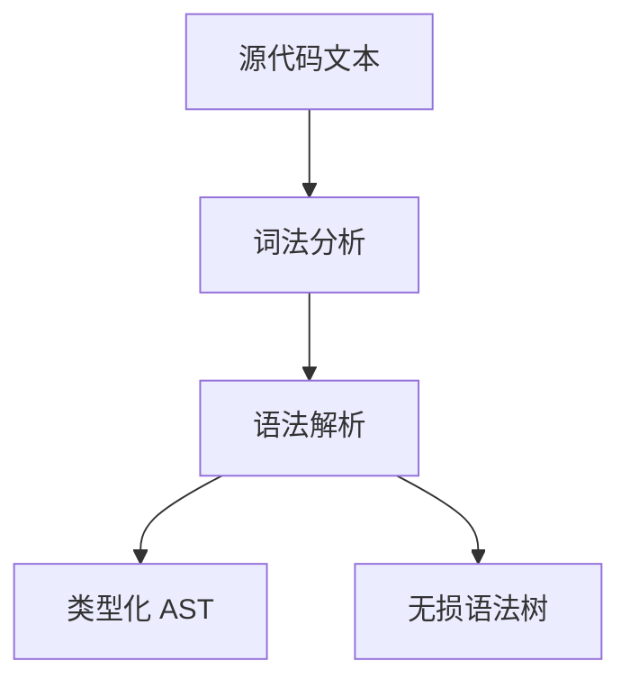
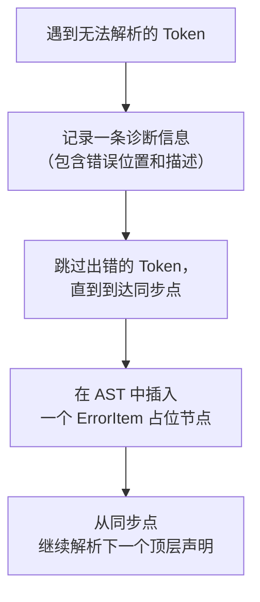

# 语法与 AST

欢迎来到语法与 AST 篇章！这篇文章我们回答 Syl 编译器如何处理源代码。先介绍前端（`syl_syntax`）的整体设计，然后讲解词法分析和语法解析的基本流程。接着重点解释一个核心设计：为什么同时存在"类型化 AST"和"无损语法树"两种表示。最后讨论错误恢复策略和节点索引的稳定算法。

---

## 前端的输入和输出

Syl 的前端负责将源代码文本转换为结构化表示。它的输入是一个字符串（源代码），输出是两个不同的结构：

- **类型化 AST（AstFile）**：给语义分析阶段使用，只包含语义上有意义的节点
- **无损语法树（LosslessSyntaxFile）**：给 LSP 和代码格式化工具使用，保留注释和空白



## 词法分析

词法分析器的工作是：读入一个字符串，输出一个 Token 列表。每个 Token 记录三样东西：

- Token 的类型（是关键字、标识符、还是运算符）
- Token 的文本内容
- Token 在源代码中的起止位置

### 为什么需要 Token

编译器不直接操作字符串。字符串是字符的序列，而编译器需要操作的是有意义的语法单位。例如 `:=` 是一个赋值运算符，不是一个冒号加一个等号。词法分析的作用就是把这些"字符组合"识别为"语法单位"。

### 处理示例

对于下面这段 Syl 代码：

```syl
cell Top(x: in Bit) { }
```

词法分析器会输出 10 个 Token。以下是每个 Token 的类型和文本：

```
cell     → 关键字 Cell
Top      → 标识符 Ident
(        → 左括号 LParen
x        → 标识符 Ident
:        → 冒号 Colon
in       → 关键字 In
Bit      → 标识符 Ident
)        → 右括号 RParen
{        → 左大括号 LBrace
}        → 右大括号 RBrace
```

每个 Token 还记录了它在原文中的起止位置（行号和列号）。这些位置信息在后续编译阶段用于生成错误消息。

## 语法解析

语法解析器的工作是：读入一个 Token 列表，输出一个树状结构（AST）。

AST 的每个节点对应一个语法构造。节点的子节点对应这个构造的组成部分。

### 从 Token 到 AST

继续使用上面的例子。解析器识别到关键字 `cell` 后，会预期后面跟着一个名字、一对括号和一对大括号。它逐步消费 Token，构建出这样的结构：

```
Item::Cell {
    name: "Top",
    params: [
        Param { name: "x", dir: In, ty: "Bit" }
    ],
    body: Block { stmts: [], tail: None }
}
```

### 顶层声明类型

Syl 的顶层声明有 9 种。解析器通过第一个关键字来区分它们：

| 关键字 | 声明类型 |
|--------|---------|
| `use` | 导入声明 |
| `const` | 常量定义 |
| `fn` | 函数定义 |
| `enum` | 枚举定义 |
| `bundle` | 数据结构定义 |
| `interface` | 接口定义 |
| `map` | 组合映射定义 |
| `cell` | 硬件单元定义 |
| `extern cell` | 外部单元声明 |

每个声明类型内部还有自己的子结构。以 `cell` 为例，它包含名字、泛型参数、端口列表、结果绑定和函数体。

```syl
cell Counter<W: Nat, D: Domain>(
    clk: in Clock<D>,
    rst: in Reset<D>,
    enable: in Bit,
) -> value: UInt<W> {

    reg count: UInt<W> reset(rst, 0)
    signal count_next: UInt<W> := count + 1
    next count := count_next
    value := count
}
```

解析器看到 `cell` 关键字后，按以下顺序解析：

1. 名字：`Counter`
2. 泛型参数：`<W: Nat, D: Domain>`
3. 端口列表：`(clk: in Clock<D>, ...)`
4. 结果绑定：`-> value: UInt<W>`
5. 函数体：`{ reg count: ... value := count }`

如果任何一个步骤失败，解析器不会崩溃，而是执行错误恢复。

## 为什么需要两种树

这是一个核心设计决策。两种树服务于不同的消费方，它们对数据的要求不同。

**类型化 AST（AstFile）** 的消费方是语义分析阶段。语义分析需要知道：

- 这是一个 `Cell`，它的名字叫 `Counter`
- 它有两个泛型参数 `W` 和 `D`
- 它的端口名叫 `clk`，方向是 `in`，类型是 `Clock<D>`

注释和空白对语义分析来说是噪音。如果 AST 中嵌入了注释节点，语义分析需要在每个步骤跳过它们，这增加了复杂度和出错可能。

**无损语法树（LosslessSyntaxFile）** 的消费方是编辑器（通过 LSP 协议）。编辑器需要知道：

- 光标在第 3 行第 15 列，这个位置落在哪个 Token 上
- 用户在第 2 行和第 3 行之间插入了一行注释，第 3 行及之后的 Token 位置应该怎样偏移
- 文件开头的版权注释是否应该保留

语义分析不关心的注释和空白，正是 LSP 最需要的信息。

### 两种树的共存方式

Syl 的解析器在解析过程中同时跟踪两类信息：

- 类型化 AST 节点：记录语义结构
- Token 列表：记录每个 Token 的类型、文本和位置

解析完成后，类型化 AST 被交给语义分析。同时，Token 列表和 AST 的节点位置信息被组合成无损语法树，交给 LSP。

这个过程没有重复解析。词法分析只做一次，语法解析只做一次。两种树来自同一次解析过程。

### 无损语法树的内部结构

无损语法树的顶层是一个 `File` 节点。它的子节点是两种元素：

- **节点（Node）**：对应一个语法构造，包含子元素
- **Token**：对应一个词法单元，包含文本内容和位置

所有 Token 按照在源代码中的出现顺序排列。节点通过记录每个子 Token 的位置范围来组织它们。

无损语法树可以精确还原为原始源代码。这是因为每个 Token 都记录了它的文本内容，而所有 Token 按顺序排列，构成了完整的源代码文本。

## 误差恢复

当解析器遇到无法识别的语法时，它执行误差恢复。误差恢复的目标是：即使部分代码有语法错误，仍然解析出尽可能多的正确结构。

### 恢复流程



### 同步点的选择

同步点选择为顶层声明的边界。具体来说，当解析器在一个顶层声明内部遇到错误时，它会一直跳过 Token，直到遇到下一个顶层声明的起始关键字（比如 `cell`、`fn`、`const`），或者遇到当前声明正常结束的位置（比如 `}`）。

这意味着一个模块内的语法错误不会影响它后面的模块。

### 恢复效果示例

```syl
cell Top(x: in Bit, y: out Bit) {
    this is broken syntax
    y := x
}

cell Tail(a: in Bit, b: out Bit) {
    b := a
}
```

解析器的输出是：

- 两个模块都被包含在 AST 中
- `Top` 模块内部有一个 `ErrorItem` 占位，以及一句恢复后的赋值语句 `y := x`
- `Tail` 模块被完整解析，没有错误
- 诊断列表中有一条关于 `Top` 模块的信息

注意 `y := x` 被正确恢复了。这是因为解析器跳过了无法解析的部分后，在遇到 `}` 之前发现了可识别的赋值语句。

## AST 节点索引

AST 节点索引为每个节点分配一个稳定的 ID。节点索引的主要用途是支持 LSP 的增量更新。

### 增量更新的需求

当用户在编辑器中编辑文件时，LSP 会收到文件的变更通知。变更通知通常是这样的格式："从第 10 行开始删除了 2 行，插入了 3 行新文本"。

如果节点的 ID 随着文件的每一处改变而改变，编辑器无法判断哪些节点没有变化。它只能丢弃所有缓存，重新请求所有信息。这会导致编辑时的卡顿。

### 稳定 ID 的生成方式

节点 ID 基于以下信息计算：

1. 节点类型（它是 `Cell`、`Fn`，还是 `Const`）
2. 节点在父节点中的位置标签
3. 附近不同类型兄弟节点的上下文

这种设计的效果是：

- 在文件开头插入一段注释，不会改变后面任何节点的 ID
- 在 `cell Foo` 后面插入一个新的 `cell Bar`，不会改变 `cell Foo` 的 ID
- 编辑一个模块内部的表达式，不会改变其他模块的节点 ID

### 一个例外场景

如果两个节点类型相同且内容也完全相同（比如 `const A = 1;` 连续出现两次），它们的 ID 会退化为从左到右的顺序编号。在这段连续序列中插入新的 `const A = 1;` 会导致后续相同节点的 ID 变化。

这个退化是故意的。因为对于完全相同的内容，没有可靠的方法来区分它们。在实际使用中，这种场景很少出现，而且即使出现，也只是影响局部节点的 ID 稳定性。

## 设计决策总结

Syl 前端的几个关键设计决策：

**两棵树，各司其职。** 语义分析和 LSP 对数据的要求不同。一棵树试图同时满足两种需求会让两者都变得复杂。两棵树各司其职，每棵树的数据模型都精简到刚好满足消费方的需求。

**解析同时生成两棵树。** 没有先解析一棵树再转换出另一棵树。词法分析和语法解析只运行一次，两种树从同一个解析过程中产生。

**误差恢复。** 解析器遇到语法错误时会尝试继续解析，尽可能多地产生正确结构。这对编辑器体验至关重要：用户在打字过程中代码不完整是常态，编译器不应该因为一个语法错误就放弃整个文件。
