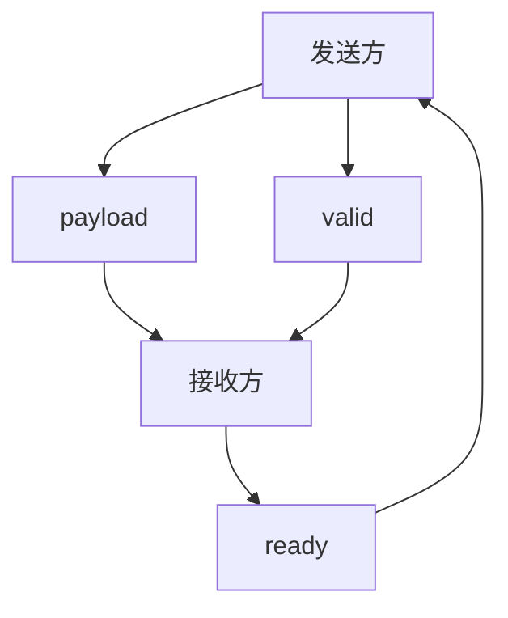

# 流接口

流接口（Stream）是 Syl 模块之间数据传递的标准方式。掌握 Stream 的使用是学习 Syl 设计模式的第一步。Stream 接口是标准库中最基础的组件，流水线、缓冲和总线协议都在它的基础上构建。理解 valid-ready 握手是理解整个 Syl 模块间通信的基础。valid-ready 协议简单且高效，被广泛用于数字硬件设计中。Stream 接口的使用贯穿了整个模式章节，是 Syl 学习中最重要的部分。建议先从流接口开始学习 Syl 的设计模式。流接口是理解其他模式的基础。，因为大多数模块间通信都基于这个模式。它基于 valid-ready 握手协议。本文说明 Stream 接口的定义、使用方法和常见变体。

---

## valid-ready 握手

valid-ready 是一种流控制协议。它广泛应用于数字硬件设计中，是 AXI-Stream、TileLink 等总线协议的基础。发送方和接收方通过两个控制信号协调数据传输：

- **valid**：发送方驱动。表示当前数据有效。
- **ready**：接收方驱动。表示当前可以接收数据。

数据在 valid 和 ready 同时为 1 的时钟周期传输。



## Stream 接口

Syl 标准库的 `Stream` 接口定义了 valid-ready 握手协议：

```syl
interface Stream<T> {
    payload: T
    valid: Bit
    ready: Bit

    view source {
        out payload
        out valid
        in ready
    }

    view sink {
        in payload
        in valid
        out ready
    }
}
```

- `Stream<T>` 的负载类型 `T` 由使用者指定
- `source` 视图：发送方视角。`payload` 和 `valid` 是输出，`ready` 是输入
- `sink` 视图：接收方视角。`payload` 和 `valid` 是输入，`ready` 是输出

## 发送方

```syl
cell Producer(
    stream: out Stream<UInt<8>>.source,
) {
    reg data: UInt<8> reset(rst, 0)
    signal handshake: Bit := stream.valid and stream.ready

    next data := select {
        handshake => data + 1,
        default => data,
    }

    stream.payload := data
    stream.valid := 1
}
```

Producer 持续发送数据。每个握手发生之后更新数据值。

## 接收方

```syl
cell Consumer(
    stream: in Stream<UInt<8>>.sink,
) {
    signal handshake: Bit := stream.valid and stream.ready

    reg received: UInt<8> reset(rst, 0)
    next received := select {
        handshake => stream.payload,
        default => received,
    }

    stream.ready := 1
}
```

Consumer 持续接收数据。每个握手时采样 `payload` 值。

## 背压

接收方可以通过拉低 `ready` 来暂停数据流。这被称为背压（backpressure）。

```syl
cell BackpressureConsumer(
    stream: in Stream<UInt<8>>.sink,
    buffer_full: in Bit,
) {
    # 缓冲区满时暂停接收
    stream.ready := not buffer_full
}
```

当 `buffer_full` 为 1 时，`ready` 为 0。发送方保持当前数据不更新。

## 流水线中的流接口

流接口在流水线中逐级传递：

```syl
cell PipelineStage<T, D: Domain>(
    clk: in Clock<D>,
    rst: in Reset<D>,
    upstream: in Stream<T>.sink,
    downstream: out Stream<T>.source,
) {
    reg saved: T reset(rst, zero<T>())
    reg valid_reg: Bit reset(rst, 0)

    signal stall: Bit := downstream.valid and not downstream.ready
    signal pass: Bit := upstream.valid and (not valid_reg or downstream.ready)

    next saved := select {
        pass => upstream.payload,
        default => saved,
    }
    next valid_reg := select {
        pass => 1,
        stall => 1,
        default => 0,
    }

    downstream.payload := saved
    downstream.valid := valid_reg
    upstream.ready := not stall
}
```

这个流水线阶段检测下游是否准备好接收。如果下游忙（`valid=1, ready=0`），阶段暂停，保持当前数据。

## 常见变体

### 无 payload 的 Stream

```syl
signal stream: Stream<Bit>.source
# 等同于一个 valid-ready 信号对
```

当 Stream 的负载类型为 `Bit` 时，它相当于单独的 valid-ready 握手。

### 带多字段 payload 的 Stream

```syl
bundle Packet {
    data: UInt<32>,
    addr: UInt<16>,
    last: Bit,
}

signal stream: Stream<Packet>.source
```

Stream 的负载可以是任意 Syl 类型。

## 标准库流组件

标准库提供流操作工具：

```syl
use std.stream.Stream

# 连接到流水线阶段
use std.stage.stage_from_stream
use std.stage.stage_to_stream
```

`stage_from_stream` 从流接口创建流水线输入阶段。`stage_to_stream` 从流水线输出阶段创建流接口。

## 设计考量

设计 Stream 接口时需要考虑几点：

**valid 和 ready 的组合逻辑。** `valid` 和 `ready` 都是组合逻辑信号。`ready` 的计算不能依赖 `valid` 的变化（否则形成组合环路）。接收方应该在任何时候都能确定 `ready` 的值。

**payload 的稳定性。** 当 `valid` 为 1 时，`payload` 必须保持稳定直到握手发生。发送方不能在 `valid` 为 1 时改变 `payload`。

**流水线深度。** 多个 Stream 级联时，每一级都会引入额外的延迟。需要考虑整体的流水线深度是否满足时序要求。

## 常见错误

### 发送方不驱动 valid

```syl
cell Bad(stream: out Stream<UInt<8>>.source) {
    stream.payload := 0
    # 错误：stream.valid 没有被赋值
}
```

发送方必须驱动 `valid`。接收方必须驱动 `ready`。

### 接收方不驱动 ready

```syl
cell Bad(stream: in Stream<UInt<8>>.sink) {
    reg data: UInt<8> reset(rst, 0)
    next data := stream.payload
    # 错误：stream.ready 没有被赋值
}
```

`ready` 是接收方的输出，必须被驱动。

### 跨域连接方向错误

```syl
# 错误：source 连接到 source 方向不匹配
# 应该 source 连接 sink
```

发送方的 `source` 视图必须连接接收方的 `sink` 视图。
